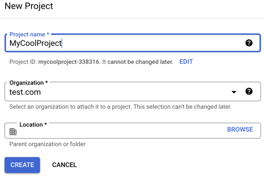
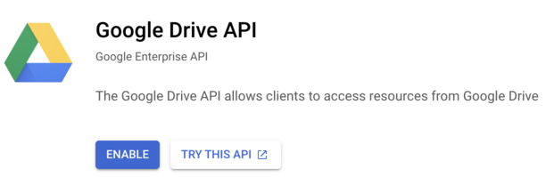
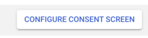
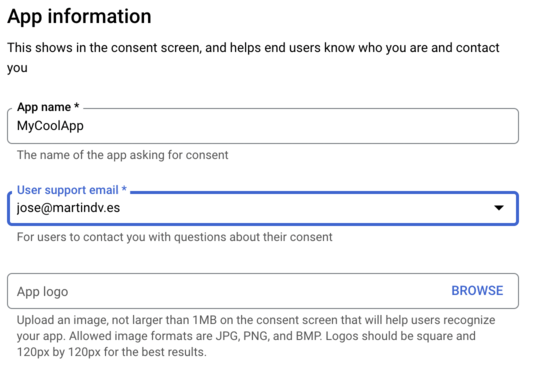
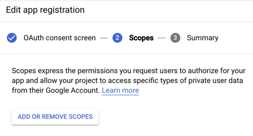
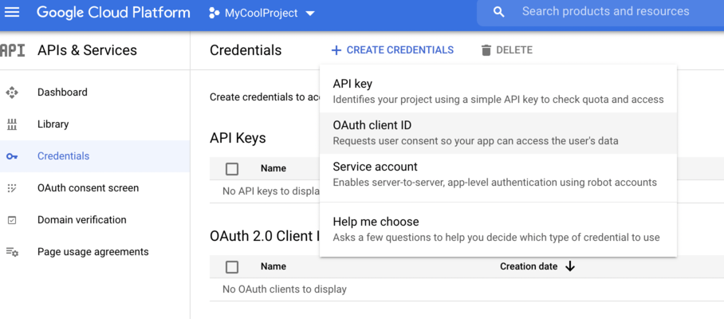
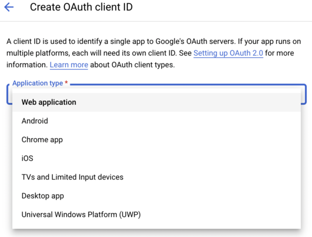
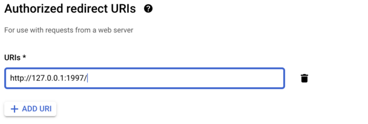
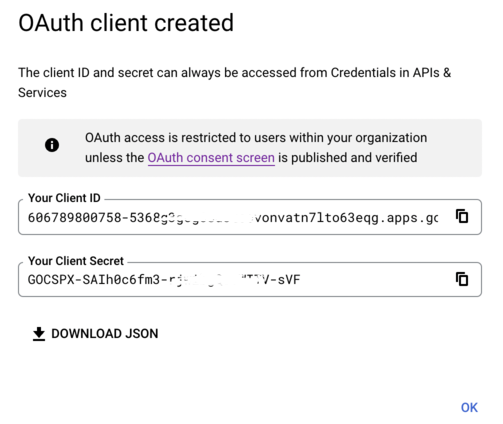

[](https://www.codefactor.io/repository/github/josemdv/test) [](https://www.python.org/downloads/release/python-360/)  [](https://github.com/josemdv/test/blob/master/LICENSE.md)
[](https://github.com/josemdv/take-home/actions/workflows/python-package.yml)


<div id="top"></div>


<!-- PROJECT LOGO -->
<br />
<div align="center">
    
  </a>

  <h3 align="center">Take-home assignment</h3>

  <p align="center">
    A set of scripts that interact with Google Drive API
    <br />
    <br />
    <a href="https://github.com/josemdv/take-home/issues">Report Bug</a>
    ·
    <a href="https://github.com/josemdv/take-home/issues">Request Feature</a>
  </p>
</div>


<!-- TABLE OF CONTENTS -->
<details>
  <summary>Table of Contents</summary>
  <ol>
    <li>
      <a href="#about-the-project">About The Project</a>
      <ul>
        <li><a href="#built-with">Built With</a></li>
      </ul>
    </li>
    <li>
      <a href="#getting-started">Getting Started</a>
      <ul>
        <li><a href="#prerequisites">Prerequisites</a></li>
        <li><a href="#installation">Installation</a></li>
      </ul>
    </li>
    <li><a href="#usage">Usage</a></li>
    <li><a href="#TODO">TODO</a></li>
    <li><a href="#contributing">Contributing</a></li>
    <li><a href="#license">License</a></li>
    <li><a href="#contact">Contact</a></li>
    <li><a href="#acknowledgments">Acknowledgments</a></li>
  </ol>
</details>


<!-- ABOUT THE PROJECT -->
## About The Project

I wrote this simple project in a few hours for a take-home assignment. The project contains three scripts:
* assesment1.py generates a report that shows the number of files and folders in total for the source folder.
* assesment2.py is a script to create a report that shows the number of files and folders for each folder under this folder id (recursively) and a total of nested folders for the source folder
* assesment3.py is a script to copy the content (nested files/folders) of the source folder to the destination folder -  [90% complete]


<p align="right">(<a href="#top">back to top</a>)</p>


### Built With

These scripts contain its own modules plus some extra frameworks/libraries. Here are a few examples.

* [Python3](https://www.python.org/downloads/)
* [Google API Python Library](https://github.com/googleapis/google-api-python-client)
* Google Auth HTTP Library
* [Google OAuth Library](https://pypi.org/project/google-auth-oauthlib/)

<p align="right">(<a href="#top">back to top</a>)</p>


<!-- GETTING STARTED -->
## Getting Started

Follow these simple example steps below to get a local copy up and running. Obviously, you can convert this project into a docker container, an importable module of a separate project, etc.

### Prerequisites

Before you can use this tool, make sure that you have the following.
* Python3 and pip3 are installed on your system
  ```sh
  https://www.python.org/downloads/
  ```
* Access to a G Suite or Google Account
* Access to Internet

### Installation

_Below you will find the instructions to install this tool. It's important that you follow all the steps in order._

1. [Create a Google Cloud Project](https://console.cloud.google.com/projectcreate
) 
<br><br><br>
2. Enable [Google Drive API](https://console.cloud.google.com/marketplace/product/google/drive.googleapis.com
) for your newly created project
<br><br><br>
3. Configure the [OAuth 2.0 consent screen](https://console.cloud.google.com/apis/credentials) with your information.
<br><br><br>
     * For User Type select *Internal*
     * Provide an app name and support email (*you can leave the rest of the field blank*)
     <br><br><br>
     * Click on Add or Remove Scopes
     <br><br><br>
         * Using the filter, search for Google Drive API
         * Select all scopes (on a production environment we will only select the necessary ones)
         * Click on *Update* and finally on *save and continue and finally*

4. Create a set of credentials for this tool. Refer to [the following guide](https://developers.google.com/workspace/guides/create-credentials) to create your web credentials
     * On you Google Cloud Console, click on credentials
     * Select - Create Credentials - OAuth Client ID
     <br><br><br>
     * For application type select: Web Application
     <br><br><br>
     * Under Authorized redirect URIs, include the following: 
         ```js
         http://127.0.0.1:1997
         ```
        <br><br>
     * Click on Create and select *Download JSON*
     <br><br>
     * **Rename** the file that just downloaded to: 
        ```js
         credentials.json
         ```


5. Clone the repo
   ```sh
   git clone https://github.com/jose/xxx.git
   ```
6. Move the *credentials.json* file to the root folder of the recently cloned repo.
7. Make sure to install all modules and packages by using pip3. For example:
    ```pip3 -r requirements.txt```

<p align="right">(<a href="#top">back to top</a>)</p>


<!-- USAGE EXAMPLES -->
## Usage

Simple! Follow the installation steps, and once completed, you should be able to run the following command on your machine:

```python3 assesment{1,2,3}.py```

Remember that you will need to install all dependencies (as stated above). It's highly recommended that you create a [virtual environment](https://docs.python.org/3/tutorial/venv.html) to install all requirements.


<p align="right">(<a href="#top">back to top</a>)</p>


<!-- TODO -->
## TODO

- [ ] Complete function to assign files to the right parents - the mapping is already done, we just need to iterate through each file recursively and use the Google Drive update method.
- [ ] Add additional logging for debugging.

See the [open issues](https://github.com/josemdv/take-home/issues) for a full list of proposed features (and known issues).

<p align="right">(<a href="#top">back to top</a>)</p>


<!-- CONTRIBUTING -->
## Contributing

Contributions are what make the open source community such an amazing place to learn, inspire, and create. Any contributions you make are **greatly appreciated**.

If you have a suggestion that would make this better, please fork the repo and create a pull request. You can also simply open an issue with the tag "enhancement".
Don't forget to give the project a star! Thanks again!

1. Fork the Project
2. Create your Feature Branch (`git checkout -b feature/AmazingFeature`)
3. Commit your Changes (`git commit -m 'Add some AmazingFeature'`)
4. Push to the Branch (`git push origin feature/AmazingFeature`)
5. Open a Pull Request

<p align="right">(<a href="#top">back to top</a>)</p>


<!-- LICENSE -->
## License

Distributed under the MIT License. See `LICENSE.txt` for more information.

<p align="right">(<a href="#top">back to top</a>)</p>


<!-- CONTACT -->
## Contact

Jose Martin de Vidales Biurrun - [@josemdv](https://twitter.com/josemdv) - jose@martindv.es

Project Link: [https://github.com/josemdv/take-home](https://github.com/josemdv/take-home)

<p align="right">(<a href="#top">back to top</a>)</p>
